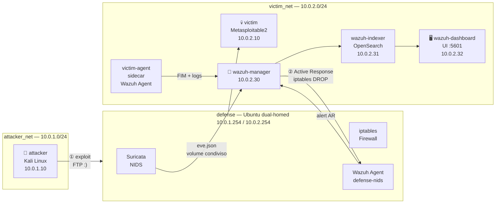

# Network Security Lab — IDS_6

Laboratorio virtuale Docker per la dimostrazione della catena **Vulnerabilità → Attacco → Rilevamento → Risposta Automatica**.

**Autore:** Rocco Marotta — Matricola M63001680  
**Corso:** Network Security

---

## Architettura



| Container | Ruolo | IP |
|---|---|---|
| `attacker` | Kali Linux — tool offensivi e Metasploit | 10.0.1.10 |
| `victim` | Metasploitable2 — target vulnerabile | 10.0.2.10 |
| `victim-agent` | Sidecar Ubuntu 22.04 — Wazuh Agent per victim | (network di victim) |
| `defense` | Ubuntu dual-homed — Suricata NIDS + iptables | 10.0.1.254 / 10.0.2.254 |
| `wazuh-manager` | Wazuh Manager — correlazione HIDS + NIDS | 10.0.2.30 |
| `wazuh-indexer` | OpenSearch — indicizzazione alert | 10.0.2.31 |
| `wazuh-dashboard` | OpenSearch Dashboards — UI web | 10.0.2.32 |

---

## Prerequisiti

- Docker Desktop (Windows/Mac) o Docker Engine (Linux)
- 4 GB di RAM disponibili per lo stack Wazuh

---

## Avvio rapido

```bash
git clone https://github.com/NS-Projects-Unina/IDS_6.git
cd IDS_6
docker compose up -d --build
```

Attendere circa 60 secondi per il bootstrap completo dello stack Wazuh.

### Prima inizializzazione (una volta sola dopo `down -v`)

Dopo ogni `docker compose down -v` è necessario reinizializzare il database di sicurezza di OpenSearch:

```powershell
docker exec -u root wazuh-indexer bash -c "JAVA_HOME=/usr/share/wazuh-indexer/jdk bash /usr/share/wazuh-indexer/plugins/opensearch-security/tools/securityadmin.sh -cd /usr/share/wazuh-indexer/opensearch-security -icl -p 9200 -cacert /usr/share/wazuh-indexer/certs/root-ca.pem -cert /usr/share/wazuh-indexer/certs/admin.pem -key /usr/share/wazuh-indexer/certs/admin-key.pem -nhnv"
```

---

## Accesso ai servizi

| Servizio | URL / Comando |
|---|---|
| Wazuh Dashboard | `https://localhost:5601` — credenziali `admin / admin` |
| DVWA (Metasploitable2) | `http://localhost:8080/dvwa` |
| Shell attaccante | `docker exec -it attacker bash` |
| Shell defense | `docker exec -it defense bash` |
| Shell wazuh-manager | `docker exec -it wazuh-manager bash` |

> Il browser mostrerà un avviso per il certificato self-signed al primo accesso alla dashboard: cliccare "Avanzate" → "Procedi comunque".

---

## Scenario d'attacco — CVE-2011-2523

Guida completa in [`docs/ATTACK_GUIDE.md`](docs/ATTACK_GUIDE.md).

```bash
# Lancia l'exploit dal container attaccante
docker exec attacker msfconsole -q -r /exploits/03-cve-metasploit/exploit.rc
```

Output atteso: `Backdoor has been spawned!`

Subito dopo, Suricata rileva l'attacco, Wazuh genera gli alert e il blocco automatico via iptables isola l'attaccante.

---

## Verifica della difesa

```powershell
# Alert Wazuh
docker exec wazuh-manager bash -c "grep -E 'Rule: 100001|Rule: 100002' /var/ossec/logs/alerts/alerts.log"

# Blocco iptables
docker exec defense bash -c "iptables -L INPUT -n | grep 10.0.1.10"

# Ping bloccato dall'attaccante
docker exec attacker ping -c 4 10.0.2.10
```

Guida completa al sistema di difesa in [`docs/DEFENSE_GUIDE.md`](docs/DEFENSE_GUIDE.md).

---

## Reset completo

```bash
docker compose down -v
docker compose up -d --build
```

Riporta tutto allo stato iniziale pulito, inclusi i volumi.
